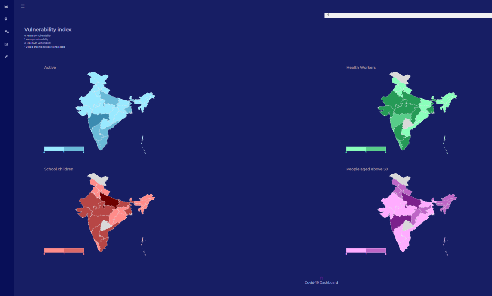
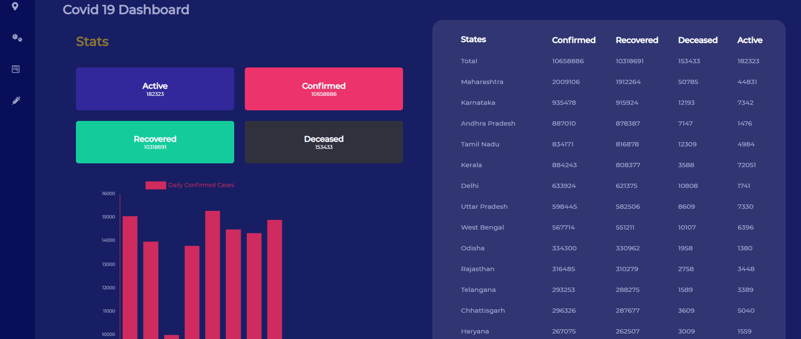
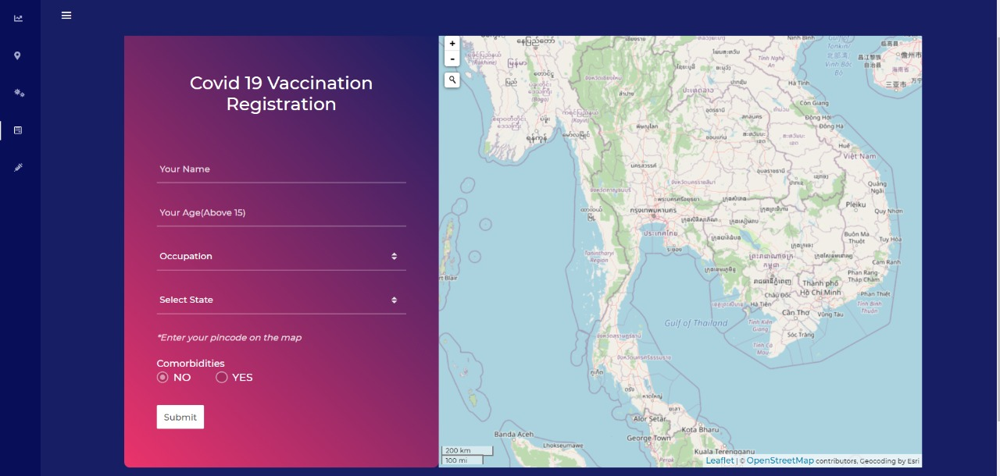
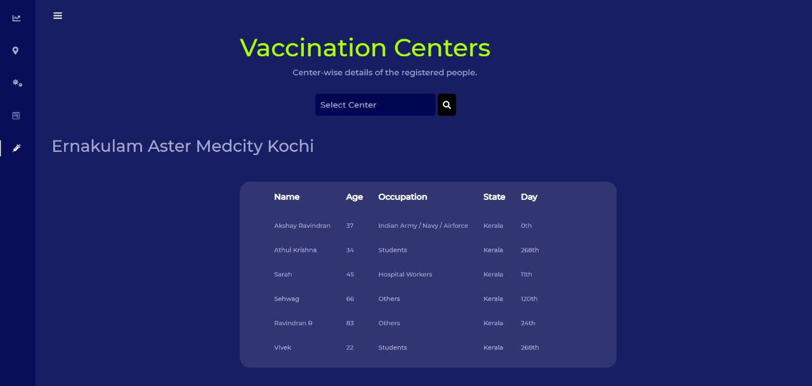

# PRIORITIZATION OF VACCINE DELIVERY
 An interactive Dashboard for prioritizing covid19 vaccine delivery in India

### Team Data Pirates
#### We present you a Machine Learning based predictive model that helps to identify specific groups within the country’s population that are more vulnerable to the pandemic and also how to efficiently distribute the vaccine among these groups. The model divides the country into 3 clusters in the order of vaccination priority based on – Population density, Number of daily Covid-19 cases , Number of Covid-19 deaths and population of the earlier mentioned priority groups.

---

#### Pre-requisites

1. Install `python3` on your device if not already by looking up the following docs([windows](https://www.python.org/downloads/windows/), [mac](https://www.python.org/downloads/mac-osx/), `ubuntu` comes pre-installed)
2. Install `virtualenv` if not already by running `pip3 install virtualenv`

---

#### Setup 

###### clone the repository
``
git clone  https://github.com/neeraj2403/Hackathon-dashboard.git
``
###### move to the cloned Directory
``
cd Hackathon-dashboard
``

#### Steps
##### For  Linux/MacOS

1. Setup a virtual env
2. Run `pip3 install -r requirements.txt` to install packages
3. Run `python3 project.py` to start the server

---

##### For  Linux/MacOS

1. Setup a virtual env
2. Run `pip install -r requirements.txt` to install packages
3. Run `python project.py` to start the server

---

### Images

